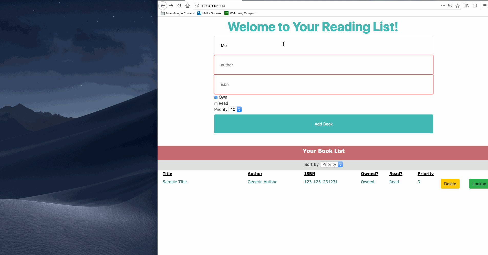

# CompareBoxes

**Compare Boxes** is a Java app that asks the user to input a value, that represents the number of boxes the program will generate, and computes the perimeter of the randomly generated boxes. It then returns both a list of all boxes generated and the details of the largest box.  

Created by: **Simcha Coleman**

## Video Walkthrough

Here's a walkthrough of implemented user stories:

GIF created with [LiceCap](http://www.cockos.com/licecap/).

## Project Analysis

This project is a variation of a homework assignment that I completed. I have changed the program somewhat from the assignment instructions in order to ensure that future students can't simply copy my code and submit it as their own. If you are a student reading this, with intentions of copying this code, if you copy this you will NOT learn. You will slowly slip away as the class progresses because you will be missing the fundamentals, so consider yourself warned. If you want to succeed in the future, do your own work.  
